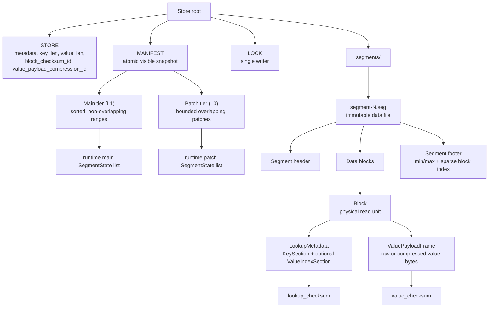
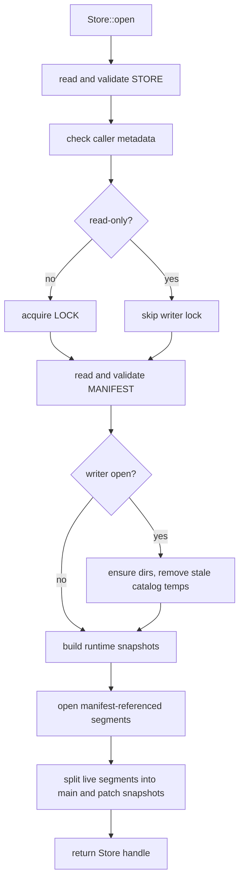
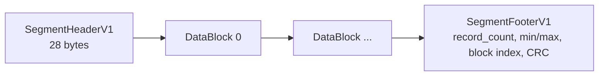
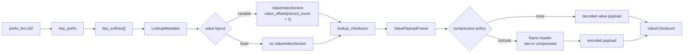
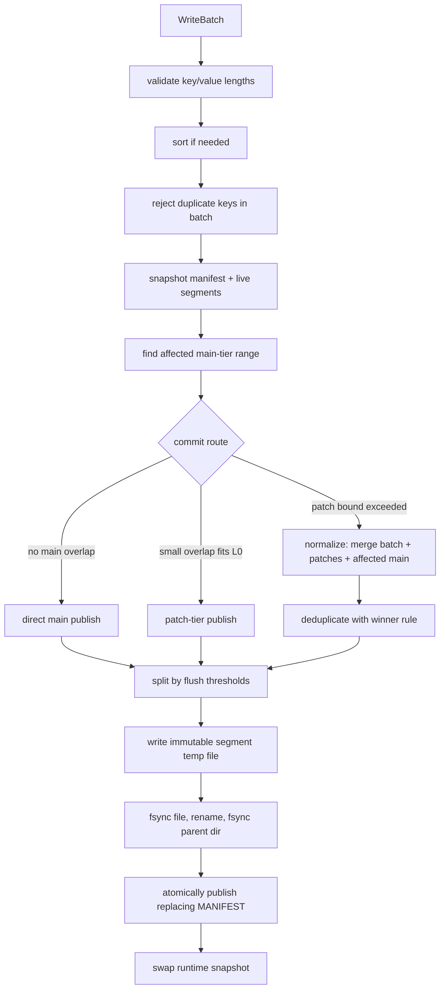
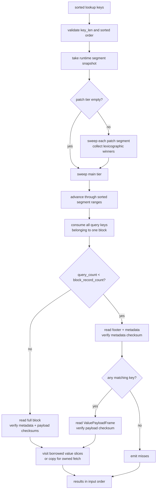
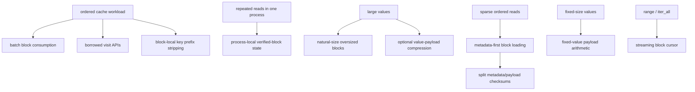

# Design

## Purpose

`segment-cache-store` is a persistent backend for computation caches with fixed-width ordered keys and opaque serialized values. It is not a general-purpose database.

The target workload is demand-driven cache filling: callers query a sorted batch of structured inputs, compute cache misses, and publish the newly computed results for later reuse. Values are allowed to be forgotten on crash or corruption because they are recomputable, but the store must never return silently corrupted data as a valid hit.

The implementation is optimized for:

- fixed-width byte keys whose lexicographic order is the caller's desired query order
- ordered batch lookup as the primary read path
- full ordered iteration for export, migration, and analysis
- immutable segment files as the file-level sync unit
- batch publication instead of individual durable writes
- corruption-as-miss semantics

The implementation intentionally does not provide:

- transactions
- deletes or tombstones
- update-in-place
- concurrent writers
- WAL recovery
- background compaction of cold ranges
- query features beyond point lookup, ordered batch lookup, and ordered range iteration

## Status And Scope

This crate is experimental. The on-disk format may change without migration support; rebuilding the cache from recomputable source data is the migration strategy.

This document describes the current implementation unless a section is explicitly marked as future work. Earlier prototype constraints such as "insert-only commits" and "globally non-overlapping segments only" are no longer current: the store now has a non-overlapping main tier plus a bounded overlapping patch tier.

Currently implemented:

- binary `MANIFEST` snapshots
- text `STORE` descriptors
- immutable segment files
- main tier plus patch tier
- replacing-manifest commits
- automatic and explicit normalization of overlapped ranges
- deterministic duplicate-key winner rule
- dead manifest-entry dropping
- advisory single-writer lock
- explicit garbage collection
- split metadata/payload block checksums
- process-local verified-block reuse

Future work is isolated in [Future Sync Design](#future-sync-design). It is not part of the current disk format.

## Core Invariants

- One store root represents one cache namespace with one caller metadata value, one fixed key length, and one value layout.
- `STORE` owns stable namespace identity and is written once during creation.
- `MANIFEST` is the only source of visible data.
- Segment files are immutable after publication.
- Segment files not referenced by `MANIFEST` are invisible.
- Main-tier segment ranges are sorted and globally non-overlapping.
- Patch-tier segment ranges are bounded and may overlap main-tier ranges or other patch-tier ranges.
- Missing, malformed, or corrupted data is treated as absent, never as valid output.
- Copies of one key across visible segments are allowed only because the caller promises those values are semantically interchangeable.
- Writes are serialized by one logical writer.

## Caller Contract

The store validates key length, fixed value length, manifest structure, segment structure, and block checksums unless the namespace was explicitly created with `BlockChecksumKind::None`. The store cannot validate the caller's logical encoding and cache semantics.

- **Stable key encoding.** The caller must encode each logical input into the same fixed-width key bytes wherever the cache is used. The store compares keys lexicographically and does not understand their internal structure.
- **Interchangeable values for one key.** If the same key appears in multiple visible segments, any value copy may be retained or returned according to the deterministic winner rule. Byte equality is not required, but the copies must be semantically equivalent for the caller's cache contract.
- **Single logical writer.** Only one writer may mutate a root at a time. The implementation enforces this for cooperating processes with an advisory lock.
- **Immutable files while open.** Segment files must not be externally modified while a `Store` handle is open. The runtime may skip repeated checksum work for block parts that were already verified in the same process.

## Terminology

### Logical Data

- `Key`: fixed-width byte string used for ordering and lookup.
- `Value`: opaque serialized byte string associated with one key.
- `Entry`: caller-provided key/value pair before it is encoded into a segment.
- `Record`: key/value pair decoded from visible storage and returned by reads or scans.
- `Copy`: one stored record for a key that may also exist in another visible segment.

`Entry` means write input. `Record` means read output. Other entry-like structures should be qualified, such as `Manifest entry` or `Block index entry`.

### Tiers

- `Main tier (L1)`: sorted, globally non-overlapping segment set.
- `Patch tier (L0)`: bounded segment set for small interleaving writes. Patch segments may overlap main segments and each other.
- `Normalization`: replacing commit that merges patch segments plus intersecting main segments into new main-tier segments.

### Catalog

- `Store root`: directory containing one cache namespace.
- `Metadata`: caller-defined compatibility bytes persisted in `STORE`.
- `STORE`: stable descriptor for metadata, key length, value layout, block checksum, and value-payload compression.
- `MANIFEST`: atomic visible-data snapshot.
- `Manifest entry`: one visible segment reference plus tier and key range.

### Physical Layout

- `Segment`: immutable file containing sorted records.
- `Segment header`: fixed-size prefix that identifies segment format and store geometry.
- `Segment footer`: variable-size suffix that is the segment completion marker and owns the sparse block index.
- `Block`: physical read unit inside a segment.
- `Block index`: segment-footer table with one entry per block.
- `KeySection`: block-local key metadata. It starts with `prefix_len:u32`, then stores the common key prefix and the fixed-width suffix table.
- `ValueIndexSection`: variable-value offset table with `record_count + 1` offsets. Fixed-value blocks do not have this section.
- `ValuePayloadFrame`: raw or compressed packed user value bytes for one block.
- `LookupMetadata`: the bytes needed to prove key membership and locate values in a block. It is `KeySection` plus `ValueIndexSection` for variable-value blocks, and just `KeySection` for fixed-value blocks.

## Architecture

The current implementation separates persistent identity, visibility, immutable bytes, and runtime snapshots.



The layering in code mirrors this structure:

- `format`: byte layouts and structural validation; no filesystem access.
- `engine`: filesystem paths, atomic publication, open/create, runtime state, segment file IO, and garbage collection.
- `read`: ordered lookup and range cursors over runtime snapshots.
- `write`: write batches and replacing-manifest commits.
- `store`: public facade that delegates to read and write layers.

## Directory Layout

Each store root contains:

```text
root/
  STORE
  STORE.tmp
  MANIFEST
  MANIFEST.tmp
  LOCK
  segments/
    segment-0000000000.seg
    segment-0000000001.seg
    segment-0000000002.seg.tmp
```

Temporary files are sibling files created by adding a `.tmp` extension to the final path. They are part of atomic publication only. Open and read paths never discover visible data by scanning directories.

`LOCK` is stable and is never atomically replaced, so cooperating writers lock the same inode. `segments/` may contain orphan files after a crash or retired files after replacement commits; they are ignored unless referenced by `MANIFEST` and are removed only by explicit best-effort garbage collection.

## Store Creation

Creation writes `MANIFEST` first and `STORE` last. `STORE` is the creation completion marker.

This order gives simple crash semantics:

- If creation crashes before `STORE` is written, `Store::open` rejects the root as missing and `Store::create` can safely recreate it.
- If creation completes, both `STORE` and `MANIFEST` exist and ordinary open can proceed.
- A leftover `MANIFEST` from aborted creation is overwritten by the next create attempt.

## Catalog Format

### STORE

`STORE` is line-oriented text, not JSON. Binary metadata is encoded as lowercase hex.

```text
segment-cache-store store v1
version=1
metadata=<hex>
key_len=<u32, decimal>
value_len=<u32, decimal>
block_checksum_id=<u32, decimal>
value_payload_compression_id=<u32, decimal>
```

`value_len=0` means variable-length values. A non-zero value means fixed-length values of exactly that many bytes. `block_checksum_id` selects the block checksum implementation used by all segments in the store. Built-in ids are `0 = BlockChecksumKind::None`, `1 = BlockChecksumKind::Crc32c`, and `2 = BlockChecksumKind::RapidHashV3_64`; `Crc32c` is exposed by the `checksum-crc32c` feature, while `RapidHashV3_64` is exposed by the default `checksum-rapidhash` feature and is the default block checksum for `CreateOptions::new`. `value_payload_compression_id` selects the store-wide value-payload compression policy. Built-in ids are `0 = ValuePayloadCompressionKind::None`, `1 = ValuePayloadCompressionKind::Lz4`, and `2 = ValuePayloadCompressionKind::ZstdLevel1`; LZ4 is exposed by the optional `value-compression-lz4` feature, Zstandard level 1 is exposed by the optional `value-compression-zstd` feature, and neither is part of the default feature set. If default features are disabled, callers must use `CreateOptions::new_with_block_checksum(key_len, metadata, kind)` so the checksum choice remains explicit. `STORE` is authoritative for `key_len`, `value_len`, `block_checksum_id`, and `value_payload_compression_id`.

### MANIFEST

`MANIFEST` is a binary snapshot. Its final CRC32C covers all previous manifest bytes.

```text
magic[4]              # b"SCSM"
version:u32           # 1
key_len:u32
next_segment_id:u32
segment_count:u32
manifest_entries[segment_count]
crc32c:u32
```

Each manifest entry is:

```text
segment_id:u32
tier:u8               # 0 = main, 1 = patch
segment_len:u64
segment_hash:u64      # whole-segment non-adversarial fingerprint
min_key[key_len]
max_key[key_len]
```

`segment_id` derives the opaque file name `segments/segment-<id>.seg`. File names do not define key order. `segment_len` and `segment_hash` bind the manifest entry to the exact segment bytes that were published. This is a non-adversarial fingerprint for accidental replacement or corruption detection, not a cryptographic authentication tag.

Manifest entry order is canonical:

- all main-tier entries first, sorted by `min_key`
- all patch-tier entries after main entries, sorted by `(min_key, segment_id)`

Open rejects malformed manifests, duplicate segment ids, invalid key ranges, overlapping main-tier ranges, patch entries before main entries, and `next_segment_id` values that could reuse an existing id.

Referenced segments that are missing, malformed, or mismatched with their manifest range are dead entries. They are invisible at open time and dropped at the next manifest publication.

## Open Path

Opening a store reconstructs runtime state from the catalog and referenced immutable segments. Directory contents are not used as data discovery.



Malformed `STORE` or `MANIFEST` files are hard open errors because they describe namespace identity and visibility. Manifest-referenced segment failures are not hard open errors: the failed segment is treated as dead miss space, omitted from runtime snapshots, and dropped on the next manifest publication by a writer.

## Segment Format

Each segment file contains:

```text
SegmentHeaderV1
DataBlock*
SegmentFooterV1
```



All integer fields are little-endian. The first data block starts immediately after the 28-byte header.

The fixed segment header is:

```text
magic[4]             # b"SCSG"
format_version:u32   # 1
key_len:u32
value_len:u32        # 0 = variable, >0 = fixed value length
block_checksum_id:u32
value_payload_compression_id:u32
header_crc32c:u32    # crc32c over previous 24 bytes
```

The footer body is variable length because it contains `min_key`, `max_key`, and the sparse block index:

```text
record_count:u64
min_key[key_len]
max_key[key_len]
block_count:u32
block_index_entries[block_count]
footer_len:u32       # footer body length
footer_crc32c:u32    # crc32c over footer body | footer_len
```

Each block index entry is:

```text
first_key[key_len]
block_offset:u64     # absolute file offset
block_len:u32
record_count:u32
```

Opening a segment validates the header, reads the footer from the end of the file, validates the footer and block index, then loads the sparse block index into memory. If the header, footer, or block index is invalid, the whole segment is ignored.

Segment encoding is deterministic for the same sorted entries and writer options. This matters for future sync convergence and for stable review of format changes.

## Block Format

Blocks have no block-level header or footer. Their length and record count come from the segment footer's block index. Block-local metadata is stored beside the section it describes: `prefix_len` is the first field in `KeySection`, variable-value offsets live in `ValueIndexSection`, optional value-payload compression metadata lives at the start of `ValuePayloadFrame`, and checksums immediately follow the bytes they protect. The checksum width is determined by `block_checksum_id`; `BlockChecksumKind::None` has width zero and stores no checksum bytes.

There is no stored `payload_offset` descriptor. The decoder derives the value frame position and decoded payload length from the store value layout:

- `payload_frame_offset = lookup_metadata_len + block_checksum.digest_len`
- variable values: `decoded_payload_len = value_offsets[record_count]`
- fixed values: `decoded_payload_len = record_count * value_len`

`LookupMetadata` is intentionally not just key bytes. For variable values, the offset table is part of lookup correctness because a corrupted offset can make a valid key return the wrong value slice. Padding is after `value_checksum` and is not checksummed.

`ValuePayloadCompressionKind::None` stores no value frame header: `ValuePayloadFrame` is exactly the decoded value payload bytes. Compression-capable kinds store a 12-byte frame header before each block's encoded payload:

```text
encoding_id:u32      # 0 = raw, 1 = lz4, 2 = zstd_level1
raw_len:u32          # decoded payload length
encoded_len:u32      # following encoded payload bytes
encoded_payload[encoded_len]
```

Compression support is a store-wide format capability, but each block records its actual frame encoding. Small or poorly compressible blocks are stored as `encoding_id=0` raw frames so the writer does not pay space or decode cost for negative compression. `CommitOptions::value_payload_compression_policy` controls the writer-side thresholds for newly written blocks. The default policy attempts compression only when the raw value payload is at least 64 KiB and keeps the compressed frame only if it saves at least 20%.

Each block strips the common prefix shared by the first and last key. Since records are sorted, that prefix is shared by every key in the block. The suffix table remains fixed-width, so lookup can binary-search by record index without variable-length key decoding.

Variable-value block layout:

```text
KeySection:
  prefix_len:u32
  key_prefix[prefix_len]
  key_suffixes[record_count * (key_len - prefix_len)]
ValueIndexSection:
  value_offsets[record_count + 1]:u32
lookup_checksum      # selected block checksum over KeySection | ValueIndexSection
ValuePayloadFrame:
  optional frame header
  values...
value_checksum       # selected block checksum over ValuePayloadFrame only
```

Fixed-value block layout:

```text
KeySection:
  prefix_len:u32
  key_prefix[prefix_len]
  key_suffixes[record_count * (key_len - prefix_len)]
lookup_checksum      # selected block checksum over KeySection
ValuePayloadFrame:
  optional frame header
  values[record_count * value_len]
value_checksum       # selected block checksum over ValuePayloadFrame only
```



For variable values, value `i` is `value_offsets[i]..value_offsets[i + 1]` in the decoded value payload; the last offset is the decoded payload length, so the last value needs no special branch. For fixed values, value `i` starts at `i * value_len` in the decoded value payload.

Block sizing is a writer policy:

- `target_block_size` is a logical split target used while grouping records into blocks
- physical block length is the actual encoded length after metadata, optional compression, and checksums
- existing segments remain readable if future commits use a different target block size because physical block lengths are stored in the block index

## Format Limits

The format uses `u32` for most sizes and counts to keep metadata compact. Write-time validation enforces:

- `key_len` must be non-zero and fit in `u32`
- one block's physical length must fit in `u32`
- one block's value payload must fit in `u32`
- one segment's block count must fit in `u32`
- one manifest's segment count must fit in `u32`
- total records per segment are counted as `u64`

These limits are above the intended workload shape and should not be approached in normal use.

## Write Path

The public write path is batch-only:

- `Store::begin_batch`
- `WriteBatch::push`
- optional `WriteBatch::mark_sorted`
- `Store::commit_batch`
- `Store::commit_batch_with_options`
- `Store::normalize`
- `Store::normalize_with_options`

`CommitOptions` controls newly written segment policy: target block size, max records per segment chunk, approximate max key/value bytes per segment chunk, and the patch policy. These options are not persistent namespace identity; future commits or explicit normalizations may use different values.



A commit first validates the input batch, sorts it when needed, and rejects duplicate keys inside the batch. It then builds a plan from one manifest/runtime snapshot.

The plan chooses one route:

- **Direct main publish** when the batch does not overlap any main-tier segment.
- **Patch publish** when the batch overlaps main-tier data but fits the patch policy.
- **Normalization** when publishing another patch would exceed the patch policy.

The default patch policy is intentionally simple: at most 8 live patch segments, and only batches with at most 4096 input records publish directly to patch. Callers may tune these values through `CommitOptions::with_patch_segment_limit` and `CommitOptions::with_patch_direct_record_limit`. Setting either limit to `0` disables direct patch publication for overlapping commits, so those commits normalize immediately.

There is no WAL. Only data referenced by a published `MANIFEST` is durable. In-progress temp files may be lost. A crash after segment rename but before manifest publish leaves an orphan segment that is invisible and later collected.

## Replacing Manifest Commit

The core write primitive is a replacing manifest publication:

> One atomic manifest snapshot removes zero or more old entries and inserts zero or more new entries.

This primitive supports tail append, gap insert, interleaving writes via L0, local normalization, dead-entry dropping, and segment-count convergence. The replacement must leave the main tier sorted and non-overlapping. Patch entries may overlap but are bounded by policy.

Normalization is foreground and demand-driven. A segment is rewritten only when a new commit intersects its range and the patch policy requires normalization, or when a caller explicitly invokes `Store::normalize` / `Store::normalize_with_options`. There is no background compaction pass that rewrites cold ranges.

Explicit normalization folds every live patch segment into the main tier and drops dead manifest entries. It is useful after many small interleaving writes when the next workflow phase is read-heavy. If no patch segments or dead entries are visible, explicit normalization is a no-op.

## Duplicate Keys And Winner Rule

Patch segments can make multiple copies of one key visible at the same time. This is safe only because of the caller contract that copies for one key are semantically interchangeable.

The deterministic winner is the lexicographically smallest value bytes:

- Reads return the winning value among visible copies.
- Normalization keeps the winning value and drops the other copies.
- The rule depends only on the set of copies, not arrival order or local history.

The winner rule is intentionally byte-based and history-independent so two replicas that eventually hold the same logical copies can converge after normalization.

## Read Path

`fetch_one` exists for completeness. It binary-searches the main tier by range, then probes patch segments whose ranges contain the key. If multiple visible copies exist, it applies the same winner rule.

Ordered lookup is the hot path:

- `Store::contains_many_ordered`
- `Store::fetch_many_ordered`
- `Store::visit_many_ordered`
- `Store::lookup_session`
- `OrderedLookup::contains_many`
- `OrderedLookup::fetch_many`
- `OrderedLookup::visit_many`

`visit_many` is the lowest-level ordered lookup API. It lets callers consume borrowed value slices, avoiding one `Vec<u8>` allocation per hit. `fetch_many` is a convenience API that copies hits into owned vectors.



When the patch tier is empty, ordered lookup sweeps the main tier directly. When patches exist, it first sweeps each patch segment over its overlapping key subrange and records patch winners, then sweeps the main tier and emits the final winner.

Within one segment, ordered lookup reuses cursor state and the last loaded block. It consumes all keys that fall before the next block's first key before loading another block.

Sparse lookup can read only block metadata first. If none of the searched keys exist in that block, the reader emits misses without loading or verifying value payload bytes. If any searched key matches, the value payload frame must be loaded, verified, and decoded before returning a hit.

With default checksum verification and a non-zero-width checksum algorithm, `contains_many_ordered` is cache-safe, not index-only. A key counts as present only if the value payload needed to prove that hit is successfully loaded and verified. If read-only checksum verification is explicitly disabled for benchmarking, or if the store was created with `BlockChecksumKind::None`, this guarantee is intentionally weakened for that open handle or namespace.

## Range And Full Scan

`range(start, end)` and `visit_range(start, end)` scan the half-open range `[start, end)`. `iter_all()` and `visit_all()` scan all visible records.

If no patch segments are visible, scan concatenates main-tier segment cursors in manifest order. If patch segments are visible, scan uses a k-way merge across main and patch cursors and deduplicates by the winner rule.

Scan cursors stream at block granularity. `visit_*` APIs return borrowed slices and do not materialize the full result set. The iterator APIs allocate owned `(Vec<u8>, Vec<u8>)` pairs for convenience.

## Corruption And Recovery Semantics

The store is allowed to forget cached data. It is not allowed to return wrong cached data.

- Corrupted segment header: whole segment ignored.
- Corrupted segment footer or block index: whole segment ignored.
- Manifest entry pointing to a missing segment: entry is invisible and later dropped.
- Manifest entry whose min/max range does not match the segment footer: segment ignored.
- Corrupted block metadata checksum: that block behaves like missing data.
- Corrupted block value payload frame checksum: matching keys in that block behave like missing data.
- Malformed block layout: that block behaves like missing data.
- Temp file after crash: ignored.
- Final segment not referenced by manifest: ignored and later collected.

Checksum verification can be disabled only for read-only opens. This is an explicit benchmarking mode, not the cache-safe default. Writable opens require checksum verification so normalization cannot merge corrupted bytes into newly checksummed output. `BlockChecksumKind::None` is different: it is a create-time block format choice with `block_checksum_id=0`, stores no checksum bytes, and therefore cannot provide corruption-as-miss for damaged block bytes.

## Atomicity And Filesystem Protocol

Catalog files and segment files use the same publication protocol:

1. write the final bytes to a sibling `.tmp` file
2. `fsync` the temp file
3. rename the temp file to the final path
4. `fsync` the parent directory

For data visibility, `MANIFEST` is the only atomic publish point. A segment file becomes visible only when a later manifest snapshot references it.

Garbage collection is an explicit writer maintenance operation. It scans `segments/` only to delete files not referenced by the current manifest. Directory contents are never used to discover visible data. Open and commit do not run segment GC automatically because read-only opens do not take the writer lock; a reader that already loaded an older manifest must have a chance to open the segment files that manifest references.

## Process Model

Within one process:

- `Store` is cheaply cloneable.
- Readers take immutable runtime snapshots of visible segments.
- Commits serialize on an internal commit lock.
- Commits do file IO without blocking existing readers of older snapshots.
- Lookup sessions and scan cursors remain valid across commits because they hold segment state from their starting snapshot.

Across processes:

- Multiple read-only opens can coexist.
- A writable open holds the advisory `LOCK` file for the lifetime of the store handle.
- A second cooperating writer fails fast with `InputError::WriterLocked`.
- Read-only opens do not take the writer lock, do not run garbage collection, and never mutate the filesystem.
- Segment garbage collection is explicit on writable handles; callers should run it only when they accept that older manifest snapshots may no longer be openable.
- External tools that mutate the root without the lock are outside the safety contract.

## Runtime Optimizations

The implementation optimizes ordered cache replay first, then reduces avoidable work for sparse reads, scans, large values, and repeated passes.



### Sparse In-Memory Block Index

Each segment loads one sparse block index entry per block into memory. This keeps open-time memory proportional to block count, not record count.

### Ordered Block Consumption

Ordered lookup processes all query keys that fall inside the current block before advancing. This avoids reloading or re-searching the same block for locality-heavy ordered streams.

### Borrowed Block Parsing

Blocks are decoded as raw bytes plus layout metadata. Lookup and scan APIs can borrow key/value slices from the decoded block. For compressed value frames, the decoded block owns a temporary decoded payload buffer and still exposes borrowed value slices from that buffer. Values are copied only by APIs that return owned vectors.

### Metadata-First Sparse Lookup

Sparse ordered lookup may read only `LookupMetadata` and `lookup_checksum` first. The reader gets `prefix_len` from the first four block bytes, derives the lookup metadata length, then validates keys and value offsets before touching value bytes. Blocks with no matching key do not require value payload IO.

### Split Block Checksums

Block checksum state is split into lookup metadata and value payload checksums. Metadata verification protects key lookup and, for variable values, the offset table used to locate value slices. Payload verification protects returned value bytes and any value-payload frame header. For fixed-value blocks this is effectively a `KeySection` checksum plus a value-payload-frame checksum; for variable-value blocks it is key-plus-offset metadata versus value payload frame.

### Optional Value-Payload Compression

Compression is deliberately below the caller codec and above the raw block payload bytes. It never changes keys or value indexes. With a compression-capable `ValuePayloadCompressionKind`, the writer can compress the whole block value payload as one frame and stores raw fallback frames for small or incompressible payloads. `ValuePayloadCompressionPolicy` is a non-persistent commit-time tuning knob: changing it affects future blocks but does not affect the reader contract for existing segments. This centralizes checksum and decompression handling in the storage backend while preserving metadata-first sparse lookup.

Compression codecs have process-local contexts. Segment writing creates one value-payload encoder per segment publish and reuses it across all blocks in that segment. Ordered lookup sessions and range cursors own value-payload decoders, so zstd can reuse its decompression context instead of recreating one per block. Decoded payload buffers are moved into the current decoded block and reclaimed by the owning cursor when that block is evicted. This keeps the public read contract borrowed while avoiding repeated zstd context creation and most repeated decoded-buffer allocation in scan-like reads.

### Process-Local Verification Reuse

Immutable segment blocks keep process-local verification state. Once a block's metadata or payload has passed checksum verification in the current process, later reads of the same part can skip recomputing that checksum. This cache is not persisted and is reset on reopen.

### Prefix-Stripped Keys

A block stores the common key prefix once and then stores fixed-width suffixes. Ordered lookup compares prefix and suffix slices directly and does not need to materialize full keys. Scan-style record access materializes full keys lazily only when borrowed full-key slices are needed.

### Fixed-Value Layout

Stores with fixed-width values can use `CreateOptions::with_fixed_value_len`. Fixed blocks omit the value offset table and compute value ranges arithmetically.

### Logical Block Sizing

`CommitOptions::target_block_size` controls how many records are grouped into one block. It is not a physical minimum size. Blocks are written at their actual encoded length, so compressed value payloads can produce much smaller physical blocks while preserving the same logical lookup granularity.

### Positioned Reads And Buffer Reuse

Segment files are read with positioned reads, so shared file handles do not have a mutable seek cursor. Lookup sessions and scan cursors reuse their previous block buffer when loading the next block.

## Future OS And Filesystem Hints

The current implementation intentionally uses ordinary buffered file IO and relies on the OS page cache. Blocks are variable-length physical units; `target_block_size` only controls logical split granularity, and the format does not add block padding for filesystem alignment.

If benchmarks show an IO bottleneck that the current read buffer reuse cannot address, OS-specific hints can be added behind a narrow internal abstraction without changing the disk format:

- sequential scan and export paths can use `posix_fadvise(SEQUENTIAL)` or platform equivalents to improve readahead
- sparse lookup paths can use `posix_fadvise(RANDOM)` or no hint to avoid excessive readahead
- large one-shot scans can optionally use `posix_fadvise(DONTNEED)` after consumption to avoid polluting the process-wide page cache
- vectored positioned reads can be evaluated if metadata-first lookup becomes syscall-bound

Lower-level strategies such as `O_DIRECT`, explicit block alignment, mmap-first readers, file preallocation, or platform-specific clone/reflink workflows are deliberately out of scope for the v1 backend. They add platform constraints and correctness surface area, and should only be introduced with benchmark evidence and tests for the affected operating systems.

## Future Sync Design

The current implementation is already shaped around immutable segment files, but the cross-device sync protocol is not implemented. The current manifest still uses local monotone `segment_id` values.

Planned sync work should be implemented as a catalog revision, not as ad-hoc behavior around the current manifest:

- Replace local `segment_id` identity with content-addressed segment references, likely BLAKE3-256 over full segment bytes.
- Add a per-root `generation:u64` to manifest publications for cheap local change detection.
- Define sync ingestion as a writer operation under the existing advisory lock.
- Keep transport out of scope: rsync, object storage, or manual file copy can move immutable segment files.
- Refuse sync between roots whose `STORE` identity differs.
- Verify content-addressed files when they cross a trust boundary; normal read paths still rely on block-local checksums.

One-way replication can copy all referenced segments and then publish a manifest snapshot on the replica. Bidirectional sync should compute a set union of segment references, then use the same patch and normalization mechanisms already used by local commits. Duplicate key copies converge through the existing winner rule once both sides normalize.

This future revision should rebuild existing experimental stores rather than migrate the current v1 catalog in place.
